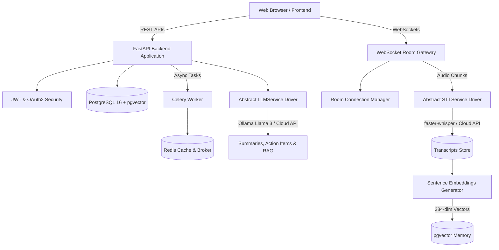

# Vocenna — Intelligent Voice Collaboration Platform

Vocenna is an intelligent voice collaboration platform enabling multilingual teams to join virtual voice rooms with real-time live transcription, translation, AI meeting summaries, RAG conversation memory, voice commands, and emotion analysis.

---

## 🏗️ Architecture & Technology Stack



- **Backend Framework:** Python 3.11+ / FastAPI (Uvicorn)
- **Database:** PostgreSQL 16 with `pgvector` extension for vector embeddings & RAG
- **ORM & Migrations:** SQLAlchemy 2.0 (Async) + Alembic
- **Cache & Real-time State:** Redis 7
- **Task Queue:** Celery with Redis broker for asynchronous AI processing
- **Speech AI:** `faster-whisper` (Abstracted behind `STTService` interface)
- **NLP / LLM AI:** Ollama (Llama 3) / Hugging Face / Cloud API (Abstracted behind `LLMService` interface)
- **Authentication:** JWT (PyJWT) + OAuth2 Password Flow
- **Containerization:** Docker & Docker Compose (Multi-stage production build)

---

## 🚀 Quickstart

### 1. Environment Setup
Create local `.env` configuration:
```bash
cp .env.example .env
```

### 2. Spin Up Services
Using Makefile or Docker Compose:
```bash
make build
make up
```
*Alternatively:* `docker compose up --build -d`

### 3. Verify Health & APIs
- **Root Health:** [http://localhost:8000/health](http://localhost:8000/health)
- **Component Health & Diagnostics:** [http://localhost:8000/api/v1/health](http://localhost:8000/api/v1/health)
- **Interactive OpenAPI Documentation:** [http://localhost:8000/docs](http://localhost:8000/docs)
- **Frontend Specification:** See [API_DOCUMENTATION.md](file:///e:/Projects/Vocenna/API_DOCUMENTATION.md)

---

## 🔄 Phase Roadmap

- [x] **Phase 0:** Project & Git Setup, Docker Compose, FastAPI foundation, `/health` endpoint.
- [x] **Phase 1:** Core Foundation & Auth (DB models, JWT Auth, Room CRUD, Swagger UI).
- [x] **Phase 2:** WebSocket Real-time Infrastructure (WS endpoints, room controls, text chat).
- [x] **Phase 3:** Speech Processing Service (faster-whisper STT, transcript persistence).
- [x] **Phase 4:** AI Intelligence Layer (LLMService, translation, action items, mood analysis).
- [x] **Phase 5:** Conversation Memory & Voice Commands (pgvector RAG & voice command parser).
- [x] **Phase 6:** Docker & Local Deployment Readiness (Makefile, production optimizations).
- [x] **Phase 7:** Frontend Preparation (API specs & CORS configuration).
